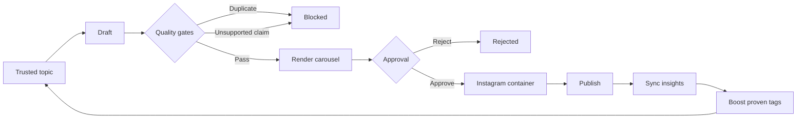

# Tech Content Agent

A production-minded MVP for:

> trusted sources → grounded AI script → carousel images → Telegram approval → Instagram publish → performance learning

It runs immediately in mock mode, so you can inspect the full workflow without API keys. Live mode can use Gemini, Anthropic, OpenAI, or an OpenAI-compatible service for structured scripts. Optional generated art supports Gemini and OpenAI; the default deterministic renderer needs no image-model credit. Telegram inline buttons handle approval, and Instagram's official API publishes carousels.

## What is included

- Trusted RSS allowlist made of first-party/vendor sources
- Topic ranking by trust, signal, freshness proxy, and learned tag performance
- Provider-neutral script generation with a strict JSON schema
- Source-bound claim checks and a hard publish block for unsupported claims
- Jaccard duplicate detection against the historical post library
- 1080×1350 deterministic carousel renderer
- Optional Gemini or OpenAI artwork behind deterministic typography
- Telegram album preview with Approve and Reject buttons
- Official Instagram carousel container and `media_publish` flow
- Insights sync and save/share-weighted topic feedback
- Responsive operations dashboard
- SQLite audit log, Docker packaging, CLI worker, and tests

## Run locally

Python 3.11+ is required.

```bash
cp .env.example .env
python -m venv .venv
source .venv/bin/activate
pip install -e ".[dev]"
uvicorn app.main:app --reload
```

Open [http://localhost:8000](http://localhost:8000), click **Run pipeline**, and approve the generated draft in the dashboard. Mock mode creates a fake Instagram media ID and mock performance metrics.

Run tests:

```bash
pytest
```

Run once from a scheduler:

```bash
python -m app.worker --demo
python -m app.worker --sync-metrics
```

## Switch to live mode

1. Set `MOCK_MODE=false`.
2. Choose a text provider and add its key. Gemini is the default:

```dotenv
TEXT_PROVIDER=gemini
GEMINI_API_KEY=your-key
GEMINI_TEXT_MODEL=gemini-2.5-flash
```

Anthropic:

```dotenv
TEXT_PROVIDER=anthropic
ANTHROPIC_API_KEY=your-key
ANTHROPIC_TEXT_MODEL=claude-haiku-4-5
```

OpenAI:

```dotenv
TEXT_PROVIDER=openai
OPENAI_API_KEY=your-key
OPENAI_TEXT_MODEL=gpt-5.6-terra
```

OpenRouter, Groq, Together, Ollama, or another API implementing OpenAI Chat Completions:

```dotenv
TEXT_PROVIDER=openai_compatible
OPENAI_COMPATIBLE_BASE_URL=https://openrouter.ai/api/v1
OPENAI_COMPATIBLE_API_KEY=your-key
OPENAI_COMPATIBLE_TEXT_MODEL=your-provider/model
```

For local Ollama, use its `/v1` URL and leave the API key empty. The selected service must support JSON-schema response formats.

3. Create a Telegram bot with BotFather and add `TELEGRAM_BOT_TOKEN` and `TELEGRAM_CHAT_ID`.
4. Configure the Telegram webhook, including the secret header:

```bash
curl "https://api.telegram.org/bot${TELEGRAM_BOT_TOKEN}/setWebhook" \
  -d "url=${APP_BASE_URL}/webhooks/telegram" \
  -d "secret_token=${TELEGRAM_WEBHOOK_SECRET}"
```

5. Configure an Instagram professional account and a Meta app. Add `INSTAGRAM_USER_ID`, `INSTAGRAM_ACCESS_TOKEN`, and the current `META_GRAPH_API_VERSION`.
6. Deploy the app to a public HTTPS URL and set `APP_BASE_URL`. Instagram must be able to fetch each generated JPEG from `/generated/...`.

The Instagram adapter intentionally does not guess a Graph API version. Put the version used by your Meta app in `.env`, and revalidate it during Meta's version-upgrade windows.

## AI provider choices

- Gemini is the default so the project can be tested using an AI Studio key without OpenAI credit.
- Anthropic uses the native Messages API structured-output format.
- OpenAI keeps the original Responses API integration and explicitly uses low reasoning effort.
- `openai_compatible` uses Chat Completions and works only when the selected service/model supports `response_format.type=json_schema`.
- Generated backgrounds are disabled by default. To use Gemini art, set `ENABLE_AI_ART=true` and `IMAGE_PROVIDER=gemini`. Use `IMAGE_PROVIDER=openai` for GPT Image.
- The deterministic renderer always owns typography because generated images can be inconsistent with exact text placement.

Provider documentation: [Gemini structured output](https://ai.google.dev/gemini-api/docs/generate-content/structured-output), [Gemini image generation](https://ai.google.dev/gemini-api/docs/generate-content/image-generation), [Anthropic structured output](https://platform.claude.com/docs/en/build-with-claude/structured-outputs), [OpenAI Responses](https://developers.openai.com/api/docs/guides/latest-model?model=gpt-5.6), and [OpenAI image generation](https://developers.openai.com/api/docs/guides/image-generation).

## Approval and publishing state machine



`AUTO_PUBLISH=false` is the MVP default. After two to three weeks, review rejection rate, factual-block rate, duplicate-block precision, publish failures, and performance variance. Turn on `AUTO_PUBLISH=true` only when:

- fewer than 5% of drafts are materially edited or rejected;
- unsupported-claim blocks are understood and low;
- at least 20–30 posts provide a useful topic-performance baseline;
- alerts exist for publish failures and token expiry;
- a daily spend cap and a kill switch are in place.

## API surface

| Method | Route | Purpose |
|---|---|---|
| `GET` | `/health` | Integration readiness |
| `GET` | `/api/dashboard` | Queue, topics, metrics, and learned scores |
| `POST` | `/api/pipeline/run` | Discover, draft, check, render, and request approval |
| `POST` | `/api/posts/{id}/approve` | Approve and publish |
| `POST` | `/api/posts/{id}/reject` | Reject a draft |
| `POST` | `/api/posts/{id}/publish` | Retry an approved/failed publish |
| `POST` | `/api/metrics/sync` | Fetch Instagram insights |
| `POST` | `/webhooks/telegram` | Process Telegram approval callbacks |

Outside development, send `Authorization: Bearer <ADMIN_TOKEN>` to dashboard API routes.

## Production checklist

- Put generated media on object storage/CDN rather than the local filesystem.
- Use Postgres and a durable queue once more than one worker runs.
- Rotate Instagram long-lived tokens and alert before expiry.
- Make the Telegram chat private and retain the webhook secret check.
- Pin the RSS source list and review additions rather than accepting arbitrary domains.
- Store source snapshots or hashes for a defensible factual audit trail.
- Add Sentry/OpenTelemetry and alert on `publish_failed`.
- Add a scheduler such as Cloud Run Jobs, ECS Scheduled Tasks, or a managed cron.

Official platform references: [Instagram content publishing](https://developers.facebook.com/docs/instagram-platform/content-publishing/), [Telegram Bot API](https://core.telegram.org/bots/api).
